Running Project Notebook
================

I’d like to see if there are any patterns in my running pace and if so
use them to make predictions about my pace in future runs. I have about
five years of running data stored in Strava, so I exported this data,
deleted some irrelevant, redundant, or personal columns, and will import
and clean it up here.

``` r
#Let's start by loading necessary packages

library(tidyverse)
```

    ## ── Attaching packages ─────────────────────────────────────────────────────────────────────────────── tidyverse 1.3.0 ──

    ## ✓ ggplot2 3.3.1     ✓ purrr   0.3.4
    ## ✓ tibble  3.0.1     ✓ dplyr   1.0.0
    ## ✓ tidyr   1.1.0     ✓ stringr 1.4.0
    ## ✓ readr   1.3.1     ✓ forcats 0.5.0

    ## ── Conflicts ────────────────────────────────────────────────────────────────────────────────── tidyverse_conflicts() ──
    ## x dplyr::filter() masks stats::filter()
    ## x dplyr::lag()    masks stats::lag()

``` r
library(lubridate)
```

    ## 
    ## Attaching package: 'lubridate'

    ## The following objects are masked from 'package:base':
    ## 
    ##     date, intersect, setdiff, union

``` r
library(zoo)
```

    ## 
    ## Attaching package: 'zoo'

    ## The following objects are masked from 'package:base':
    ## 
    ##     as.Date, as.Date.numeric

``` r
library(modelr)

# Import the dataset

activities <- read_csv("activities.csv",
                       col_types = cols(
  `Activity ID` = col_double(),
  `Activity Date` = col_character(),
  `Activity Name` = col_character(),
  `Activity Type` = col_character(),
  `Elapsed Time` = col_double(),
  Distance = col_double(),
  Commute = col_logical(),
  `Moving Time` = col_double(),
  `Max Speed` = col_double(),
  `Elevation Gain` = col_double(),
  `Elevation Loss` = col_double(),
  `Elevation Low` = col_double(),
  `Elevation High` = col_double(),
  `Max Grade` = col_double(),
  `Average Grade` = col_double()
                                )
                       )

# I'm only intersted in running for now, so I'm going to filter out any other activities (which I haven't recorded as consistently)

activities <- activities %>%
        filter(`Activity Type` == "Run") %>%
        mutate(date = mdy_hms(`Activity Date`)) %>%
        mutate(date = with_tz(date, "America/New_York")) %>%
        mutate(date = as_date(date))
```

``` r
head(activities)
```

    ## # A tibble: 6 x 16
    ##   `Activity ID` `Activity Date` `Activity Name` `Activity Type` `Elapsed Time`
    ##           <dbl> <chr>           <chr>           <chr>                    <dbl>
    ## 1     493704225 Jul 17, 2015, … Morning Run     Run                       2349
    ## 2     493704226 Jul 14, 2015, … Morning Run     Run                       2151
    ## 3     493704236 Jul 21, 2015, … Morning Run     Run                       2287
    ## 4     493704240 Jul 19, 2015, … Morning Run     Run                       2909
    ## 5     493704241 Jul 24, 2015, … Morning Run     Run                       2243
    ## 6     493704242 Jul 28, 2015, … Morning Run     Run                       2121
    ## # … with 11 more variables: Distance <dbl>, Commute <lgl>, `Moving Time` <dbl>,
    ## #   `Max Speed` <dbl>, `Elevation Gain` <dbl>, `Elevation Loss` <dbl>,
    ## #   `Elevation Low` <dbl>, `Elevation High` <dbl>, `Max Grade` <dbl>, `Average
    ## #   Grade` <dbl>, date <date>

``` r
tail(activities)
```

    ## # A tibble: 6 x 16
    ##   `Activity ID` `Activity Date` `Activity Name` `Activity Type` `Elapsed Time`
    ##           <dbl> <chr>           <chr>           <chr>                    <dbl>
    ## 1    3608398510 Jun 13, 2020, … Morning Run     Run                       2234
    ## 2    3614418225 Jun 14, 2020, … Lunch Run       Run                       2761
    ## 3    3618553412 Jun 15, 2020, … Morning Run     Run                       2140
    ## 4    3628696347 Jun 17, 2020, … Morning Run     Run                       2823
    ## 5    3633957142 Jun 18, 2020, … Morning Run     Run                       2623
    ## 6    3638935247 Jun 19, 2020, … Lunch Run       Run                       3663
    ## # … with 11 more variables: Distance <dbl>, Commute <lgl>, `Moving Time` <dbl>,
    ## #   `Max Speed` <dbl>, `Elevation Gain` <dbl>, `Elevation Loss` <dbl>,
    ## #   `Elevation Low` <dbl>, `Elevation High` <dbl>, `Max Grade` <dbl>, `Average
    ## #   Grade` <dbl>, date <date>

So we’re left with 708 runs recorded between July 17, 2015 and June 19,
2020. Some of the columns that might contribute to my speed include
“Activity Date” (how old I was), “Distance,” and “Elevation Gain.” I
could also estimate how well trained I was at any particular moment
(say, how much I had run in the previous twelve weeks), and my recovery
status (say, how much I had run in the previous two days).

Let’s start by looking at my pace over time to see if any patterns leap
out.

``` r
# Calculate pace and plot changes over time
# "Distance" is in km and "Moving Time" is in seconds
# So we get a pace of seconds / km

activities <- activities %>%
        mutate(pace = `Moving Time` / Distance)

ggplot(activities, mapping = aes(x = date, y = pace)) +
        geom_point()
```

    ## Warning: Removed 1 rows containing missing values (geom_point).

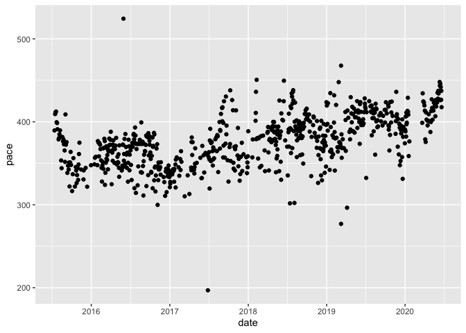<!-- -->

I wonder what’s going on with the outliers where I’m much faster or
slower than usual

``` r
activities %>%
        filter(pace > 450)
```

    ## # A tibble: 3 x 17
    ##   `Activity ID` `Activity Date` `Activity Name` `Activity Type` `Elapsed Time`
    ##           <dbl> <chr>           <chr>           <chr>                    <dbl>
    ## 1     592881749 May 30, 2016, … Vernooy Kill F… Run                       3588
    ## 2    1399074927 Feb 9, 2018, 1… Last morning i… Run                       2902
    ## 3    2201408297 Mar 9, 2019, 1… Tour DeCatur 1… Run                        753
    ## # … with 12 more variables: Distance <dbl>, Commute <lgl>, `Moving Time` <dbl>,
    ## #   `Max Speed` <dbl>, `Elevation Gain` <dbl>, `Elevation Loss` <dbl>,
    ## #   `Elevation Low` <dbl>, `Elevation High` <dbl>, `Max Grade` <dbl>, `Average
    ## #   Grade` <dbl>, date <date>, pace <dbl>

The slowest run is a trail run with a big elevation gain, so we should
be able to account for it with regression analysis later on. The second
slowest run I was accompanying my child on a fun run, so it doesn’t
indicate my own efforts. I never go on a runs that short, so I can
probably eliminate some uncharacteristic data by removing distances of
less than two kilometers without losing any useful data.

``` r
activities %>%
        filter(pace < 300)
```

    ## # A tibble: 4 x 17
    ##   `Activity ID` `Activity Date` `Activity Name` `Activity Type` `Elapsed Time`
    ##           <dbl> <chr>           <chr>           <chr>                    <dbl>
    ## 1     766638220 Nov 5, 2016, 2… Morning Run     Run                       2095
    ## 2    1333521620 Jun 27, 2017, … Afternoon Run   Run                       2591
    ## 3    2201519090 Mar 9, 2019, 2… Tour DeCatur 5k Run                       1360
    ## 4    2268955915 Apr 6, 2019, 1… Cooper River B… Run                       2979
    ## # … with 12 more variables: Distance <dbl>, Commute <lgl>, `Moving Time` <dbl>,
    ## #   `Max Speed` <dbl>, `Elevation Gain` <dbl>, `Elevation Loss` <dbl>,
    ## #   `Elevation Low` <dbl>, `Elevation High` <dbl>, `Max Grade` <dbl>, `Average
    ## #   Grade` <dbl>, date <date>, pace <dbl>

At least two of the fast runs are races, but one of them looks like a
misclassified bike ride. I don’t think I can run that fast\! Let’s
remove it from the data set and replot the data.

``` r
activities <- activities %>%
        filter(pace > 200) %>%
        filter(Distance > 2)
        
        ggplot(activities, mapping = aes(x = date, y = pace)) +
        geom_point()
```

<!-- -->

It does look like I might be getting slightly slower over time. Is it
aging or something else? Let’s fit a model to the data to see what we’re
working with.

``` r
mod_date <- lm(pace ~ date, activities)
mod_date
```

    ## 
    ## Call:
    ## lm(formula = pace ~ date, data = activities)
    ## 
    ## Coefficients:
    ## (Intercept)         date  
    ##  -211.19030      0.03355

``` r
anova(mod_date)
```

    ## Analysis of Variance Table
    ## 
    ## Response: pace
    ##            Df Sum Sq Mean Sq F value    Pr(>F)    
    ## date        1 210080  210080  329.66 < 2.2e-16 ***
    ## Residuals 699 445449     637                      
    ## ---
    ## Signif. codes:  0 '***' 0.001 '**' 0.01 '*' 0.05 '.' 0.1 ' ' 1

``` r
ggplot(activities, mapping = aes(x = date, y = pace)) +
        geom_point() +
        geom_abline(slope = 0.03355, intercept = -211.19030)
```

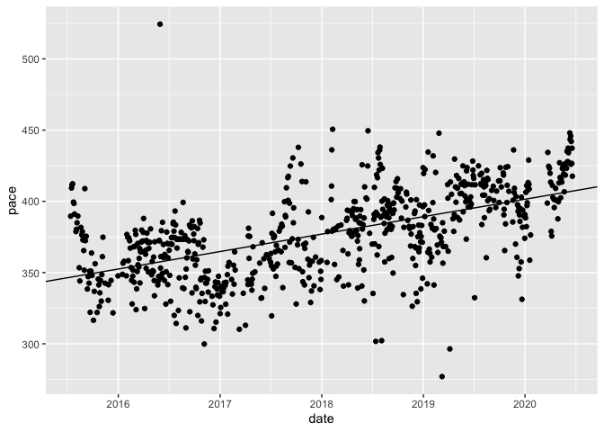<!-- -->

I’ve definitely been getting slower over the past five years, but is it
just the passage of time or are their other explanations?

Distance seems like it would be an important factor for pace. Let’s take
a look:

``` r
mod_distance <- lm(pace ~ Distance, activities)
mod_distance
```

    ## 
    ## Call:
    ## lm(formula = pace ~ Distance, data = activities)
    ## 
    ## Coefficients:
    ## (Intercept)     Distance  
    ##    373.0588       0.5395

``` r
anova(mod_distance)
```

    ## Analysis of Variance Table
    ## 
    ## Response: pace
    ##            Df Sum Sq Mean Sq F value  Pr(>F)  
    ## Distance    1   5176  5176.3  5.5635 0.01861 *
    ## Residuals 699 650353   930.4                  
    ## ---
    ## Signif. codes:  0 '***' 0.001 '**' 0.01 '*' 0.05 '.' 0.1 ' ' 1

``` r
ggplot(activities, mapping = aes(x = Distance, y = pace)) +
        geom_point() +
        geom_abline(slope = 0.5395, intercept = 373.0588)
```

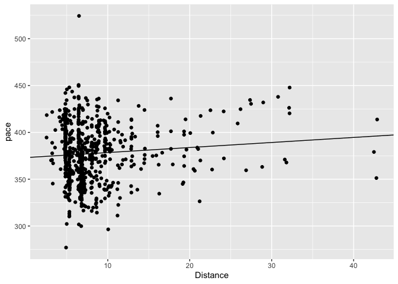<!-- -->

Distance certainly makes a difference, but not as much as I might have
thought. The three longest runs are marathons, which means I was
well-trained and ready to race.

Let’s consider elevation gain:

``` r
activities <- activities %>%
        rename(elevation_gain = `Elevation Gain`)
mod_elevation <- lm(pace ~ elevation_gain, activities)
mod_elevation
```

    ## 
    ## Call:
    ## lm(formula = pace ~ elevation_gain, data = activities)
    ## 
    ## Coefficients:
    ##    (Intercept)  elevation_gain  
    ##       361.6337          0.1613

``` r
anova(mod_elevation)
```

    ## Analysis of Variance Table
    ## 
    ## Response: pace
    ##                 Df Sum Sq Mean Sq F value    Pr(>F)    
    ## elevation_gain   1  76815   76815  94.447 < 2.2e-16 ***
    ## Residuals      593 482295     813                      
    ## ---
    ## Signif. codes:  0 '***' 0.001 '**' 0.01 '*' 0.05 '.' 0.1 ' ' 1

``` r
ggplot(activities, mapping = aes(x = elevation_gain, y = pace)) +
        geom_point() +
        geom_abline(slope = 0.1613, intercept = 361.6337)
```

    ## Warning: Removed 106 rows containing missing values (geom_point).

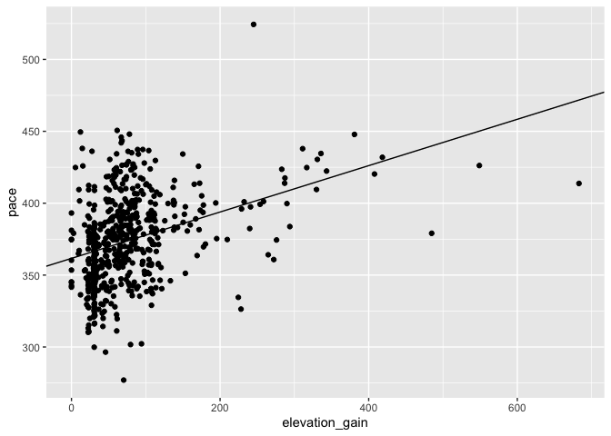<!-- -->

It looks like elevation makes a difference.

Now let’s consider my training prior to any particular run. To do this
I’ll first need to calculate my total distance during the twelve weeks
prior to any particular run.

``` r
activities <- activities %>%
        complete(date = seq.Date(min(date), max(date), by="day")) %>%
        mutate(training = rollapply(Distance, width = list(-85:-1), sum, 
                                    align = "right", partial = TRUE, 
                                    na.rm = TRUE, fill = 0))

mod_training <- lm(pace ~ training, activities)
mod_training
```

    ## 
    ## Call:
    ## lm(formula = pace ~ training, data = activities)
    ## 
    ## Coefficients:
    ## (Intercept)     training  
    ##   387.61810     -0.03712

``` r
anova(mod_training)
```

    ## Analysis of Variance Table
    ## 
    ## Response: pace
    ##            Df Sum Sq Mean Sq F value    Pr(>F)    
    ## training    1  13744 13744.3   14.97 0.0001195 ***
    ## Residuals 699 641785   918.1                      
    ## ---
    ## Signif. codes:  0 '***' 0.001 '**' 0.01 '*' 0.05 '.' 0.1 ' ' 1

``` r
ggplot(activities, mapping = aes(x = training, y = pace)) +
        geom_point() +
        geom_abline(slope = -.03712, intercept = 387.6180)
```

    ## Warning: Removed 1102 rows containing missing values (geom_point).

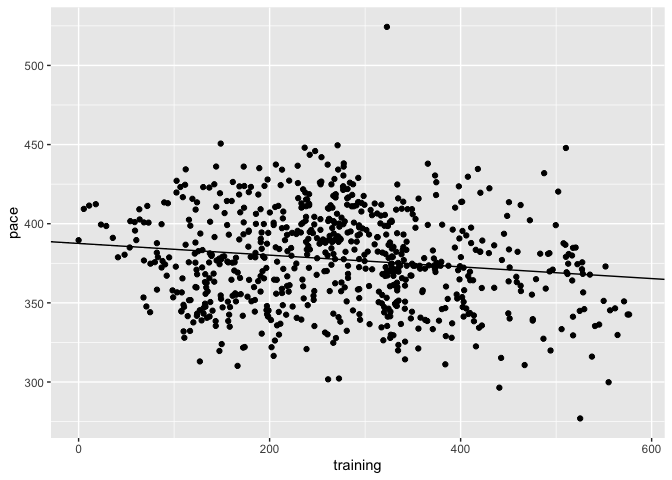<!-- -->

So my pace does seem to drop with increased training, but maybe not as
drastically as I would hope. Let’s see what recovery days do to my pace.

``` r
activities <- activities %>%
        mutate(recovery = rollapply(Distance, width = list(-3:-1), sum, 
                                    align = "right", partial = TRUE, 
                                    na.rm = TRUE, fill = 0))

mod_recovery <- lm(pace ~ recovery, activities)
mod_recovery
```

    ## 
    ## Call:
    ## lm(formula = pace ~ recovery, data = activities)
    ## 
    ## Coefficients:
    ## (Intercept)     recovery  
    ##    374.8203       0.2668

``` r
anova(mod_recovery)
```

    ## Analysis of Variance Table
    ## 
    ## Response: pace
    ##            Df Sum Sq Mean Sq F value Pr(>F)
    ## recovery    1   2489 2488.84   2.664 0.1031
    ## Residuals 699 653040  934.25

``` r
confint(mod_recovery)
```

    ##                   2.5 %      97.5 %
    ## (Intercept) 370.9149402 378.7257258
    ## recovery     -0.0541308   0.5876726

``` r
ggplot(activities, mapping = aes(x = recovery, y = pace)) +
        geom_point() +
        geom_abline(slope = 0.2668, intercept = 374.8203)
```

    ## Warning: Removed 1102 rows containing missing values (geom_point).

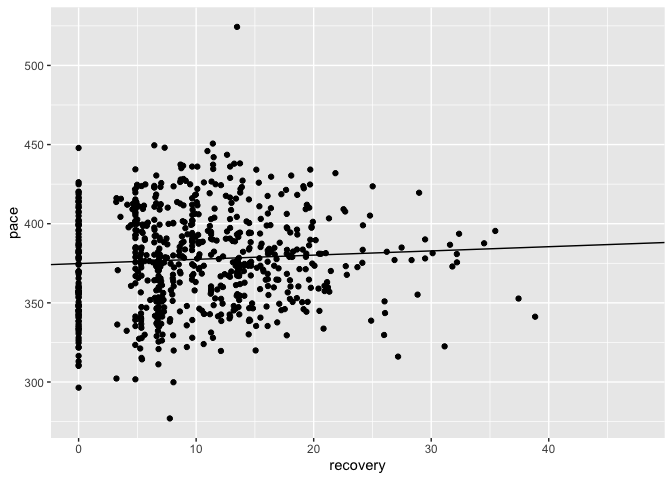<!-- -->

So the more I ran in the previous two days, the slower I run on any
given day, just as I would expect, but the result is not significant.

Maybe training plus recovery together will produce a more meaningful
model

``` r
mod_training_recovery <- lm(pace ~ training + recovery, activities)
mod_training_recovery
```

    ## 
    ## Call:
    ## lm(formula = pace ~ training + recovery, data = activities)
    ## 
    ## Coefficients:
    ## (Intercept)     training     recovery  
    ##   385.31546     -0.04926      0.56733

``` r
anova(mod_training_recovery)
```

    ## Analysis of Variance Table
    ## 
    ## Response: pace
    ##            Df Sum Sq Mean Sq F value    Pr(>F)    
    ## training    1  13744 13744.3  15.180 0.0001072 ***
    ## recovery    1   9787  9786.9  10.809 0.0010607 ** 
    ## Residuals 698 631998   905.4                      
    ## ---
    ## Signif. codes:  0 '***' 0.001 '**' 0.01 '*' 0.05 '.' 0.1 ' ' 1

It seems like they do.

So on their own, each of the variables considered above seems
significant. Let’s put them together and see what we get.

``` r
mod_overall1 <- lm(pace ~ date + training + recovery + elevation_gain + 
                          Distance, activities)
mod_overall1
```

    ## 
    ## Call:
    ## lm(formula = pace ~ date + training + recovery + elevation_gain + 
    ##     Distance, data = activities)
    ## 
    ## Coefficients:
    ##    (Intercept)            date        training        recovery  elevation_gain  
    ##     -118.52262         0.02829        -0.07605         0.82490         0.10984  
    ##       Distance  
    ##        0.35693

``` r
anova(mod_overall1)
```

    ## Analysis of Variance Table
    ## 
    ## Response: pace
    ##                 Df Sum Sq Mean Sq  F value    Pr(>F)    
    ## date             1 157598  157598 278.1044 < 2.2e-16 ***
    ## training         1  14894   14894  26.2820 4.007e-07 ***
    ## recovery         1  10984   10984  19.3822 1.271e-05 ***
    ## elevation_gain   1  41131   41131  72.5808 < 2.2e-16 ***
    ## Distance         1    725     725   1.2788    0.2586    
    ## Residuals      589 333779     567                       
    ## ---
    ## Signif. codes:  0 '***' 0.001 '**' 0.01 '*' 0.05 '.' 0.1 ' ' 1

The results here show up as statistically significant with the exception
of distance. I suspect that if I exclude the outliers (three marathons),
we’ll get a more meaningful result.

``` r
no_marathons <- activities %>%
        filter(Distance < 40)
mod_distance2 <- lm(pace ~ Distance, no_marathons)
mod_distance2
```

    ## 
    ## Call:
    ## lm(formula = pace ~ Distance, data = no_marathons)
    ## 
    ## Coefficients:
    ## (Intercept)     Distance  
    ##    372.2565       0.6475

``` r
anova(mod_distance)
```

    ## Analysis of Variance Table
    ## 
    ## Response: pace
    ##            Df Sum Sq Mean Sq F value  Pr(>F)  
    ## Distance    1   5176  5176.3  5.5635 0.01861 *
    ## Residuals 699 650353   930.4                  
    ## ---
    ## Signif. codes:  0 '***' 0.001 '**' 0.01 '*' 0.05 '.' 0.1 ' ' 1

``` r
ggplot(no_marathons, mapping = aes(x = Distance, y = pace)) +
        geom_point() +
        geom_abline(slope = 0.6475, intercept = 372.2565)
```

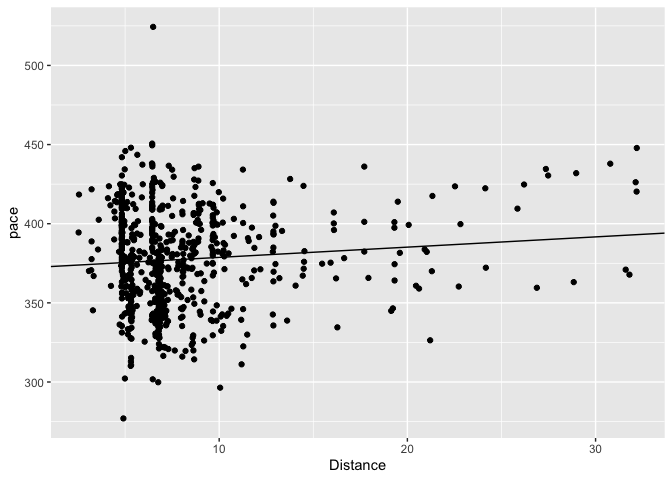<!-- -->

That made a difference, but maybe not as much as I expected. Let’s see
if our overall model behaves more like we would expect it to using this
filtered data set.

``` r
mod_overall3 <- lm(pace ~ date + training + recovery + elevation_gain + 
                          Distance, no_marathons)
mod_overall3
```

    ## 
    ## Call:
    ## lm(formula = pace ~ date + training + recovery + elevation_gain + 
    ##     Distance, data = no_marathons)
    ## 
    ## Coefficients:
    ##    (Intercept)            date        training        recovery  elevation_gain  
    ##     -117.45363         0.02816        -0.07646         0.80405         0.11648  
    ##       Distance  
    ##        0.50042

``` r
anova(mod_overall3)
```

    ## Analysis of Variance Table
    ## 
    ## Response: pace
    ##                 Df Sum Sq Mean Sq  F value    Pr(>F)    
    ## date             1 157287  157287 278.6216 < 2.2e-16 ***
    ## training         1  15041   15041  26.6435 3.356e-07 ***
    ## recovery         1  11636   11636  20.6126 6.827e-06 ***
    ## elevation_gain   1  40991   40991  72.6130 < 2.2e-16 ***
    ## Distance         1   1216    1216   2.1535    0.1428    
    ## Residuals      586 330807     565                       
    ## ---
    ## Signif. codes:  0 '***' 0.001 '**' 0.01 '*' 0.05 '.' 0.1 ' ' 1

``` r
confint(mod_overall3)
```

    ##                        2.5 %       97.5 %
    ## (Intercept)    -199.74222132 -35.16502988
    ## date              0.02344537   0.03286589
    ## training         -0.09390378  -0.05900747
    ## recovery          0.51624242   1.09186032
    ## elevation_gain    0.06486438   0.16809051
    ## Distance         -0.16932451   1.17017137

The results for Distance are still without statistical significance.
There may just be too much noise around this variable. Many short runs
are recovery runs. Many longer runs are races.

So far it seems like the second overall model provides the best tool for
predicting pace. Let’s return to the model and take a moment to evaluate
its quality.

``` r
mod_overall <- lm(pace ~ date + training + recovery + elevation_gain, 
                   activities)
summary(mod_overall)
```

    ## 
    ## Call:
    ## lm(formula = pace ~ date + training + recovery + elevation_gain, 
    ##     data = activities)
    ## 
    ## Residuals:
    ##     Min      1Q  Median      3Q     Max 
    ## -89.710 -13.377  -0.567  15.018 142.557 
    ## 
    ## Coefficients:
    ##                  Estimate Std. Error t value Pr(>|t|)    
    ## (Intercept)    -97.209678  36.633132  -2.654  0.00818 ** 
    ## date             0.027110   0.002118  12.801  < 2e-16 ***
    ## training        -0.073670   0.008642  -8.525  < 2e-16 ***
    ## recovery         0.820331   0.146432   5.602 3.25e-08 ***
    ## elevation_gain   0.131293   0.015415   8.517  < 2e-16 ***
    ## ---
    ## Signif. codes:  0 '***' 0.001 '**' 0.01 '*' 0.05 '.' 0.1 ' ' 1
    ## 
    ## Residual standard error: 23.81 on 590 degrees of freedom
    ##   (1208 observations deleted due to missingness)
    ## Multiple R-squared:  0.4017, Adjusted R-squared:  0.3977 
    ## F-statistic: 99.04 on 4 and 590 DF,  p-value: < 2.2e-16

``` r
confint(mod_overall)
```

    ##                       2.5 %       97.5 %
    ## (Intercept)    -169.1568893 -25.26246743
    ## date              0.0229505   0.03126933
    ## training         -0.0906417  -0.05669749
    ## recovery          0.5327400   1.10792128
    ## elevation_gain    0.1010188   0.16156726

``` r
activities <- activities %>% 
  add_residuals(mod_overall)

ggplot(activities, aes(resid)) + 
  geom_freqpoly(binwidth = 0.5)
```

    ## Warning: Removed 1208 rows containing non-finite values (stat_bin).

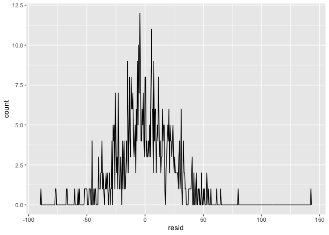<!-- -->

``` r
ggplot(activities, aes(pace, resid)) + 
  geom_ref_line(h = 0) +
  geom_point() 
```

    ## Warning: Removed 1208 rows containing missing values (geom_point).

<!-- -->

This model seems like it’s capturing significant patterns in the data,
but the residuals remain skewed in an apparently linear pattern with
faster paces being underestimated and slower paces being overestimated.
I suspect that these results are simply a matter of important
information that is not represented in the data set: races, workouts,
easy runs, weather, etc. Sometimes I’m taking it easy and sometimes I’m
going as fast as I can and those internal factors are not recorded in
this data set.

If, however, I were only trying to predict race times, I might be able
to get a more accurate model since I try to go as fast as I can when I’m
racing.

Athlinks has a record of the races I’ve run during this time frame.
There does not seem to be an obvious way to download this data, but it’s
not a big data set, so I can manually mark the races in my Strava data
set. (Strava also has this information but did not include it in their
.csv file)

``` r
# I know this is not an elegant solution, but it works

races <- activities %>%
        filter(date == "2016-11-20" | 
                       date == "2017-11-05" |
                       date == "2018-04-07" |
                       date == "2018-07-04" |
                       date == "2018-07-14" | 
                       date == "2018-08-04" |
                       date == "2018-10-21" |
                       date == "2018-11-22" |
                       date == "2019-03-09" |
                       date == "2019-04-06" |
                       date == "2019-07-04" |
                       date == "2019-10-20" |
                       date == "2019-11-28") %>%
  mutate(race = TRUE)
races
```

    ## # A tibble: 13 x 21
    ##    date       `Activity ID` `Activity Date` `Activity Name` `Activity Type`
    ##    <date>             <dbl> <chr>           <chr>           <chr>          
    ##  1 2016-11-20     781038658 Nov 20, 2016, … Philadelphia M… Run            
    ##  2 2017-11-05    1263187049 Nov 5, 2017, 3… NYC Marathon    Run            
    ##  3 2018-04-07    1494358470 Apr 7, 2018, 1… Cooper River B… Run            
    ##  4 2018-07-04    1680245406 Jul 4, 2018, 1… Peachtree Road… Run            
    ##  5 2018-07-14    1701646433 Jul 14, 2018, … Decatur Dekalb… Run            
    ##  6 2018-08-04    1748849967 Aug 4, 2018, 1… Hot, humid, an… Run            
    ##  7 2018-10-21    1918560765 Oct 21, 2018, … Atlanta 10 Mil… Run            
    ##  8 2018-11-22    1978828177 Nov 22, 2018, … Atlanta Half M… Run            
    ##  9 2019-03-09    2201519090 Mar 9, 2019, 2… Tour DeCatur 5k Run            
    ## 10 2019-04-06    2268955915 Apr 6, 2019, 1… Cooper River B… Run            
    ## 11 2019-07-04    2503241358 Jul 4, 2019, 1… 🍑 🌲 50        Run            
    ## 12 2019-10-20    2803676789 Oct 20, 2019, … Atlanta 10 Mil… Run            
    ## 13 2019-11-28    2897342324 Nov 28, 2019, … 🍑🍑🍑          Run            
    ## # … with 16 more variables: `Elapsed Time` <dbl>, Distance <dbl>,
    ## #   Commute <lgl>, `Moving Time` <dbl>, `Max Speed` <dbl>,
    ## #   elevation_gain <dbl>, `Elevation Loss` <dbl>, `Elevation Low` <dbl>,
    ## #   `Elevation High` <dbl>, `Max Grade` <dbl>, `Average Grade` <dbl>,
    ## #   pace <dbl>, training <dbl>, recovery <dbl>, resid <dbl>, race <lgl>

``` r
activities <- activities %>%
  filter(date == "2016-11-20" | 
                       date != "2017-11-05" |
                       date != "2018-04-07" |
                       date != "2018-07-04" |
                       date != "2018-07-14" | 
                       date != "2018-08-04" |
                       date != "2018-10-21" |
                       date != "2018-11-22" |
                       date != "2019-03-09" |
                       date != "2019-04-06" |
                       date != "2019-07-04" |
                       date != "2019-10-20" |
                       date != "2019-11-28") %>%
  mutate(race = FALSE)

activities <- rbind(activities, races) %>%
  arrange(date)
```

Now let’s see how our model does with this much more limited data set.
Three out of thirteen races do not include elevation data. When
elevation is taken out, distance becomes statistically significant. I’ll
need to revisit the models above with distance instead of elevation.

``` r
mod_race_model <- lm(pace ~ date + training + recovery + Distance, 
                     races)
summary(mod_race_model)
```

    ## 
    ## Call:
    ## lm(formula = pace ~ date + training + recovery + Distance, data = races)
    ## 
    ## Residuals:
    ##     Min      1Q  Median      3Q     Max 
    ## -18.501  -5.628   1.787   4.832  20.843 
    ## 
    ## Coefficients:
    ##               Estimate Std. Error t value Pr(>|t|)    
    ## (Intercept) -146.88092  292.38359  -0.502  0.62895    
    ## date           0.02674    0.01603   1.668  0.13377    
    ## training      -0.16263    0.03261  -4.988  0.00107 ** 
    ## recovery       1.23745    1.27447   0.971  0.36001    
    ## Distance       3.11890    0.35949   8.676 2.42e-05 ***
    ## ---
    ## Signif. codes:  0 '***' 0.001 '**' 0.01 '*' 0.05 '.' 0.1 ' ' 1
    ## 
    ## Residual standard error: 12.68 on 8 degrees of freedom
    ## Multiple R-squared:  0.9185, Adjusted R-squared:  0.8778 
    ## F-statistic: 22.54 on 4 and 8 DF,  p-value: 0.0002062

``` r
confint(mod_race_model)
```

    ##                     2.5 %       97.5 %
    ## (Intercept) -821.11868980 527.35685568
    ## date          -0.01021658   0.06369389
    ## training      -0.23782146  -0.08743672
    ## recovery      -1.70148633   4.17638996
    ## Distance       2.28991525   3.94788165

``` r
races <- races %>% 
  add_residuals(mod_race_model)

ggplot(races, aes(resid)) + 
  geom_freqpoly(binwidth = 0.5)
```

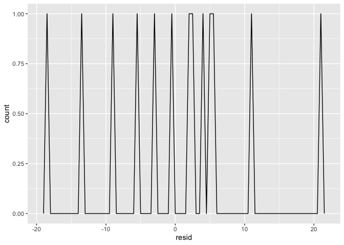<!-- -->

``` r
ggplot(races, aes(pace, resid)) + 
  geom_ref_line(h = 0) +
  geom_point() 
```

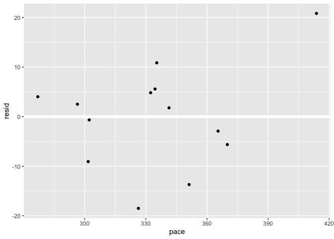<!-- -->

There’s not enough residuals to be really confident, but they don’t seem
to be skewed like the larger data set’s residuals were. Unfortunately
the only statistically significant coefficient is training. Elevation
gain is obviously correlated with distance, but if we calculate
elevation gain per kilometer then we might get another usable variable.

``` r
races <- races %>%
  mutate(elevation_per_km = elevation_gain / Distance)

mod_race_model_2 <- lm(pace ~ date + training + recovery + Distance 
                       + elevation_per_km, races)
summary(mod_race_model_2)
```

    ## 
    ## Call:
    ## lm(formula = pace ~ date + training + recovery + Distance + elevation_per_km, 
    ##     data = races)
    ## 
    ## Residuals:
    ##        1        2        3        4        5        6        7        8 
    ##  -5.2404  10.7654   2.4080   9.6043  -8.9015   0.1337   5.1752 -22.5922 
    ##        9       10 
    ##  -1.0285   9.6761 
    ## 
    ## Coefficients:
    ##                    Estimate Std. Error t value Pr(>|t|)  
    ## (Intercept)      -947.80825 1081.52343  -0.876   0.4303  
    ## date                0.07133    0.06064   1.176   0.3047  
    ## training           -0.20540    0.06285  -3.268   0.0308 *
    ## recovery            3.31025    3.20357   1.033   0.3598  
    ## Distance            3.91213    1.00850   3.879   0.0179 *
    ## elevation_per_km    0.52027    1.02358   0.508   0.6380  
    ## ---
    ## Signif. codes:  0 '***' 0.001 '**' 0.01 '*' 0.05 '.' 0.1 ' ' 1
    ## 
    ## Residual standard error: 15.43 on 4 degrees of freedom
    ##   (3 observations deleted due to missingness)
    ## Multiple R-squared:  0.9274, Adjusted R-squared:  0.8367 
    ## F-statistic: 10.22 on 5 and 4 DF,  p-value: 0.02139

``` r
confint(mod_race_model_2)
```

    ##                          2.5 %        97.5 %
    ## (Intercept)      -3950.5986947 2054.98219497
    ## date                -0.0970425    0.23969989
    ## training            -0.3799057   -0.03089515
    ## recovery            -5.5842768   12.20476865
    ## Distance             1.1120704    6.71218049
    ## elevation_per_km    -2.3216352    3.36216798

``` r
races <- races %>% 
  add_residuals(mod_race_model_2)

ggplot(races, aes(resid)) + 
  geom_freqpoly(binwidth = 0.5)
```

    ## Warning: Removed 3 rows containing non-finite values (stat_bin).

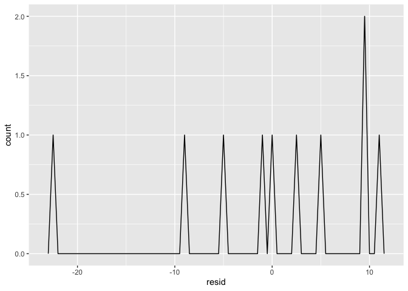<!-- -->

``` r
ggplot(races, aes(pace, resid)) + 
  geom_ref_line(h = 0) +
  geom_point() 
```

    ## Warning: Removed 3 rows containing missing values (geom_point).

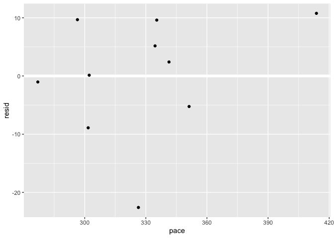<!-- -->

So here, training and distance are the only statistically significant
coefficients. Let’s try applying this model to the full data set. Since
we know which runs are races now, let’s incorporate this variable as
well. After playing around I bit with months and seasons as proxies for
the weather, I landed on simply specifying whether or not it’s summer.

``` r
activities <- activities %>%
  mutate(elevation_per_km = elevation_gain / Distance) %>%
  mutate(month = month(date)) %>%
  mutate(summer = ifelse(month == 6 | month == 7 | month == 8, 
                         TRUE, FALSE))

mod_overall_model_2 <- lm(pace ~ date + training + recovery + Distance 
                       + elevation_per_km + race + summer, activities)
summary(mod_overall_model_2)
```

    ## 
    ## Call:
    ## lm(formula = pace ~ date + training + recovery + Distance + elevation_per_km + 
    ##     race + summer, data = activities)
    ## 
    ## Residuals:
    ##     Min      1Q  Median      3Q     Max 
    ## -88.782 -13.134  -0.649  15.018 135.831 
    ## 
    ## Coefficients:
    ##                    Estimate Std. Error t value Pr(>|t|)    
    ## (Intercept)      -1.099e+02  4.401e+01  -2.496   0.0128 *  
    ## date              2.689e-02  2.606e-03  10.318  < 2e-16 ***
    ## training         -7.332e-02  8.825e-03  -8.308 6.54e-16 ***
    ## recovery          7.566e-01  1.443e-01   5.242 2.21e-07 ***
    ## Distance          1.629e+00  1.862e-01   8.747  < 2e-16 ***
    ## elevation_per_km  1.204e+00  2.705e-01   4.452 1.02e-05 ***
    ## raceTRUE         -5.904e+01  7.732e+00  -7.635 9.00e-14 ***
    ## summerTRUE        9.669e+00  2.232e+00   4.333 1.73e-05 ***
    ## ---
    ## Signif. codes:  0 '***' 0.001 '**' 0.01 '*' 0.05 '.' 0.1 ' ' 1
    ## 
    ## Residual standard error: 23.51 on 597 degrees of freedom
    ##   (1211 observations deleted due to missingness)
    ## Multiple R-squared:  0.4432, Adjusted R-squared:  0.4367 
    ## F-statistic:  67.9 on 7 and 597 DF,  p-value: < 2.2e-16

``` r
confint(mod_overall_model_2)
```

    ##                          2.5 %       97.5 %
    ## (Intercept)      -196.29704642 -23.43162210
    ## date                0.02177100   0.03200674
    ## training           -0.09064935  -0.05598720
    ## recovery            0.47314769   1.04012208
    ## Distance            1.26303869   1.99442697
    ## elevation_per_km    0.67302286   1.73556793
    ## raceTRUE          -74.22139570 -43.85005581
    ## summerTRUE          5.28579813  14.05144084

``` r
activities <- activities %>% 
  add_residuals(mod_overall_model_2)

ggplot(activities, aes(resid)) + 
  geom_freqpoly(binwidth = 0.5)
```

    ## Warning: Removed 1211 rows containing non-finite values (stat_bin).

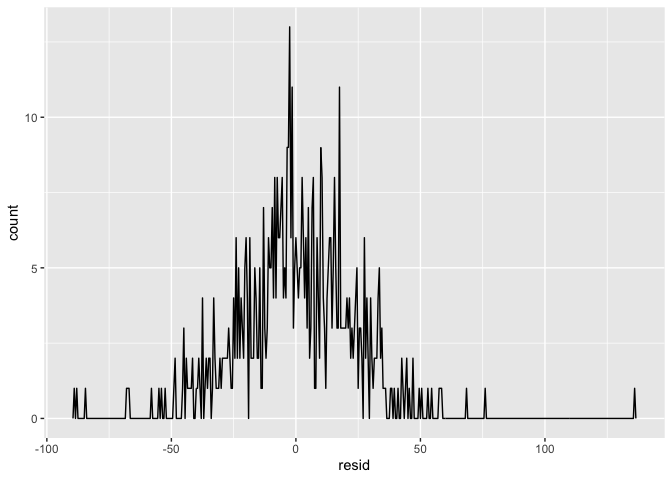<!-- -->

``` r
ggplot(activities, aes(pace, resid)) + 
  geom_ref_line(h = 0) +
  geom_point() 
```

    ## Warning: Removed 1211 rows containing missing values (geom_point).

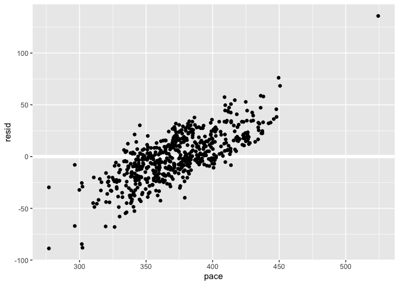<!-- -->

There’s still a lot of variability to be explained (other factors
include weather and my own effort), but I think we can have a fairly
high degree of confidence in this model It seems to be most precise for
paces around 375 seconds per kilometer and less precise for slower and
faster paces.

Finally, let’s revisit the race model, now taking season into accout.

``` r
races <- races %>%
  mutate(month = month(date)) %>%
  mutate(summer = ifelse(month == 6 | month == 7 | month == 8, 
                         TRUE, FALSE))

mod_final_race <- lm(pace ~ date + training + recovery + Distance 
                       + elevation_per_km + summer, races)
summary(mod_final_race)
```

    ## 
    ## Call:
    ## lm(formula = pace ~ date + training + recovery + Distance + elevation_per_km + 
    ##     summer, data = races)
    ## 
    ## Residuals:
    ##        1        2        3        4        5        6        7        8 
    ##  -5.2068  10.6985   2.8941   9.0127  -9.2080   0.1953   5.5386 -22.6571 
    ##        9       10 
    ##  -0.8047   9.5374 
    ## 
    ## Coefficients:
    ##                    Estimate Std. Error t value Pr(>|t|)  
    ## (Intercept)      -990.72875 1486.89740  -0.666   0.5529  
    ## date                0.07371    0.08309   0.887   0.4404  
    ## training           -0.20541    0.07254  -2.832   0.0661 .
    ## recovery            3.35532    3.79351   0.884   0.4416  
    ## Distance            3.95762    1.44501   2.739   0.0714 .
    ## elevation_per_km    0.47809    1.42340   0.336   0.7591  
    ## summerTRUE          1.07028   20.14658   0.053   0.9610  
    ## ---
    ## Signif. codes:  0 '***' 0.001 '**' 0.01 '*' 0.05 '.' 0.1 ' ' 1
    ## 
    ## Residual standard error: 17.81 on 3 degrees of freedom
    ##   (3 observations deleted due to missingness)
    ## Multiple R-squared:  0.9275, Adjusted R-squared:  0.7825 
    ## F-statistic: 6.397 on 6 and 3 DF,  p-value: 0.07816

``` r
confint(mod_final_race)
```

    ##                          2.5 %       97.5 %
    ## (Intercept)      -5722.6999058 3.741242e+03
    ## date                -0.1907170 3.381318e-01
    ## training            -0.4362667 2.545099e-02
    ## recovery            -8.7173223 1.542796e+01
    ## Distance            -0.6410655 8.556297e+00
    ## elevation_per_km    -4.0518049 5.007976e+00
    ## summerTRUE         -63.0451272 6.518568e+01

``` r
races <- races %>% 
  add_residuals(mod_final_race)

ggplot(races, aes(resid)) + 
  geom_freqpoly(binwidth = 0.5)
```

    ## Warning: Removed 3 rows containing non-finite values (stat_bin).

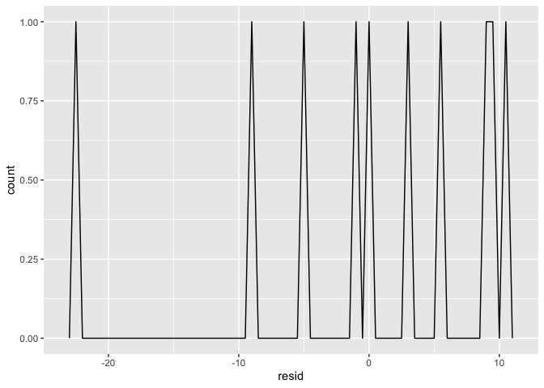<!-- -->

``` r
ggplot(races, aes(pace, resid)) + 
  geom_ref_line(h = 0) +
  geom_point() 
```

    ## Warning: Removed 3 rows containing missing values (geom_point).

<!-- -->

Oddly in this case, adding season reduced the predictive power of the
model. What if I take out season and recovery, which is pretty
consistent from race to race? And let’s also try removing date and
elevation per kilometer since they don’t seem to be contributing much?
And the amount of training and the length of a race are related to each
other, so let’s take that into account as well.

``` r
mod_final_race_2 <- lm(pace ~ Distance * training, races)
summary(mod_final_race_2)
```

    ## 
    ## Call:
    ## lm(formula = pace ~ Distance * training, data = races)
    ## 
    ## Residuals:
    ##      Min       1Q   Median       3Q      Max 
    ## -25.5821  -4.4076  -0.7528   8.6510  13.6402 
    ## 
    ## Coefficients:
    ##                     Estimate Std. Error t value Pr(>|t|)    
    ## (Intercept)       312.114902  19.331110  16.146 5.94e-08 ***
    ## Distance            4.823973   1.172822   4.113  0.00262 ** 
    ## training           -0.097230   0.051327  -1.894  0.09071 .  
    ## Distance:training  -0.004651   0.002619  -1.775  0.10955    
    ## ---
    ## Signif. codes:  0 '***' 0.001 '**' 0.01 '*' 0.05 '.' 0.1 ' ' 1
    ## 
    ## Residual standard error: 12.08 on 9 degrees of freedom
    ## Multiple R-squared:  0.9167, Adjusted R-squared:  0.8889 
    ## F-statistic: 33.02 on 3 and 9 DF,  p-value: 3.47e-05

``` r
confint(mod_final_race_2)
```

    ##                          2.5 %       97.5 %
    ## (Intercept)       268.38489316 3.558449e+02
    ## Distance            2.17086559 7.477081e+00
    ## training           -0.21334099 1.888032e-02
    ## Distance:training  -0.01057647 1.274802e-03

``` r
races <- races %>% 
  add_residuals(mod_final_race_2)

ggplot(races, aes(resid)) + 
  geom_freqpoly(binwidth = 0.5)
```

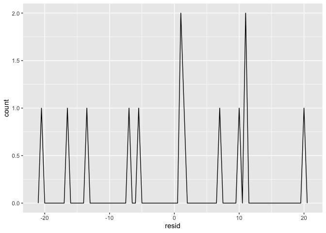<!-- -->

``` r
ggplot(races, aes(pace, resid)) + 
  geom_ref_line(h = 0) +
  geom_point() 
```

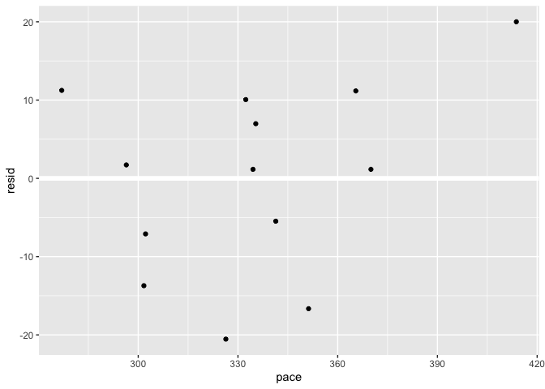<!-- -->

It seems to be that a simple model taking into account only race
distance,the number of kilometers I trained, and their intersection with
each other has the most explanatory power.
